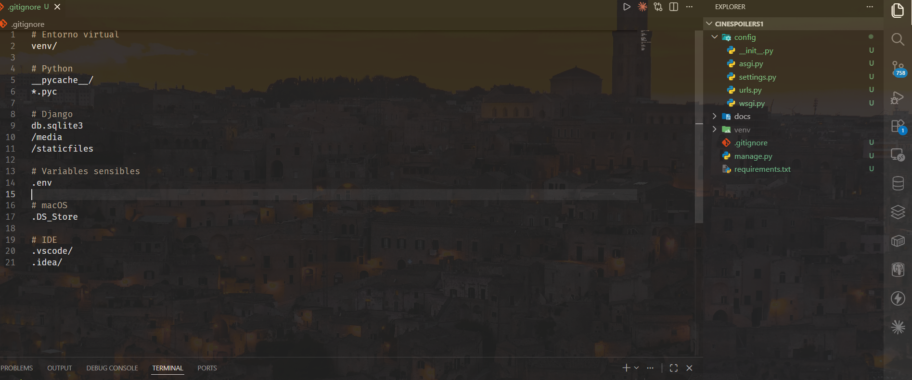
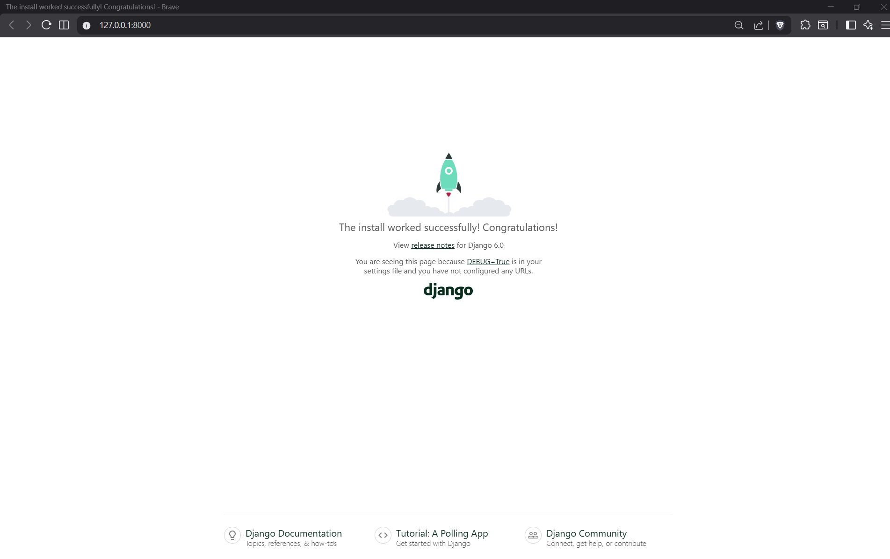
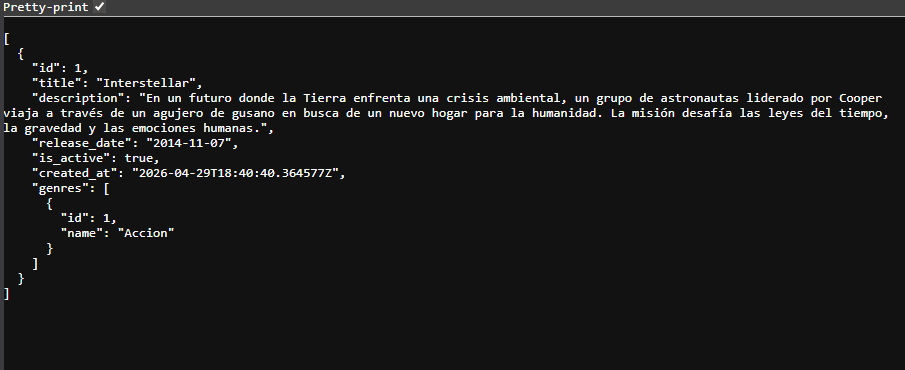
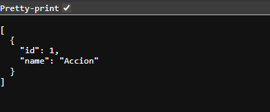
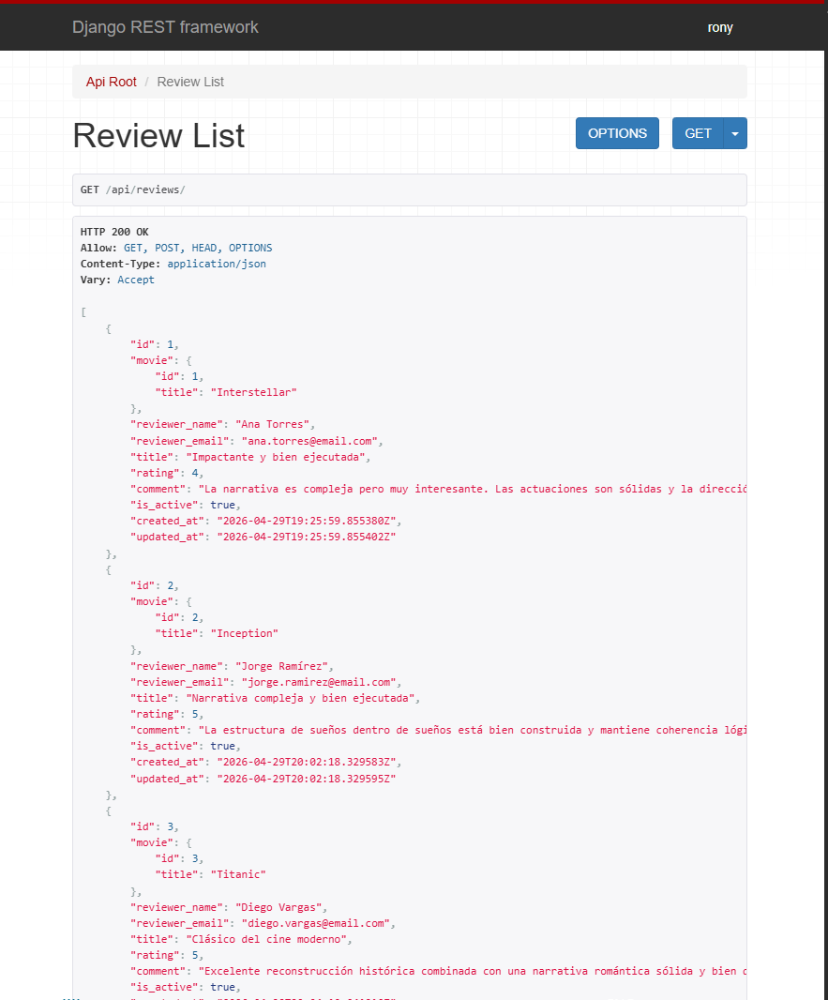
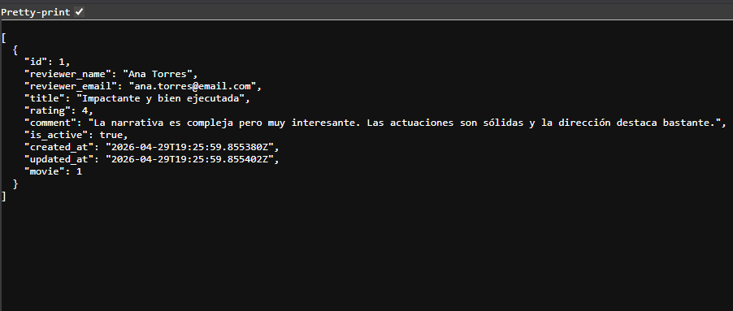
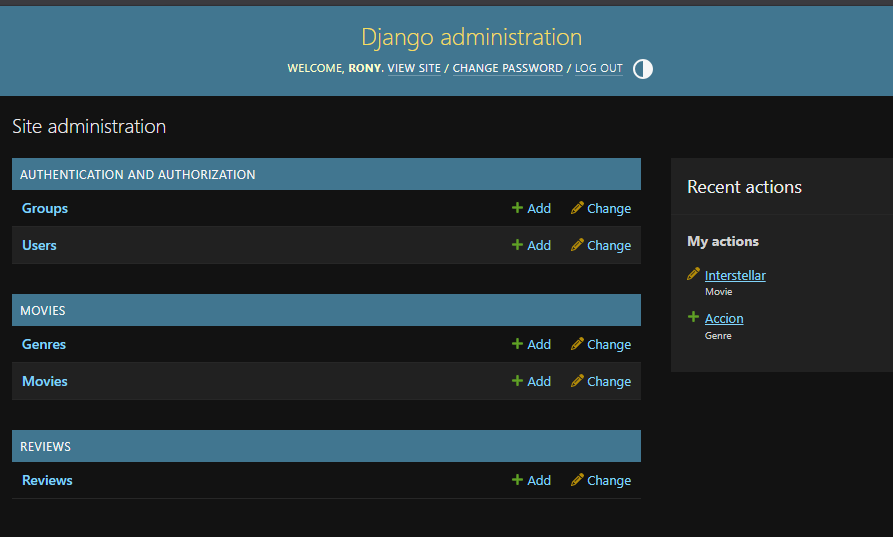
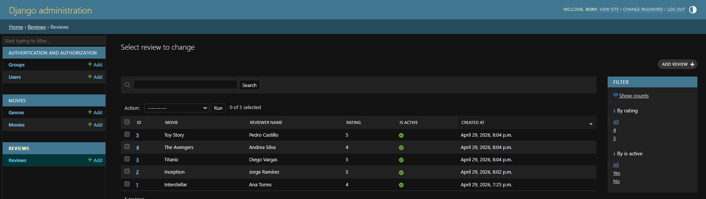

# 🎬 Cinespoilers API

## 👨‍💻 Autor

### Rony Quintana Llanque

---

## 📌 Descripción

Proyecto backend desarrollado con Django y Django REST Framework para la gestión de películas (cine).

---

## 📂 Evidencias

Las evidencias del desarrollo se encuentran en la carpeta:

### 📸 Ejemplos:

* Configuración del proyecto
* Creación de modelos
* Pruebas de API
* Panel de administración

---

## 🖼️ Capturas

# Evidencia 1: Configuración inicial y estructura del proyecto

# Evidencia 2: Creación de modelos y pruebas en el panel de administración

# Evidencia 3: Conexion de muchos a muchos entre peliculas y generos, y pruebas de API

# Evidencia 4: Creacion de reviews y pruebas de API

